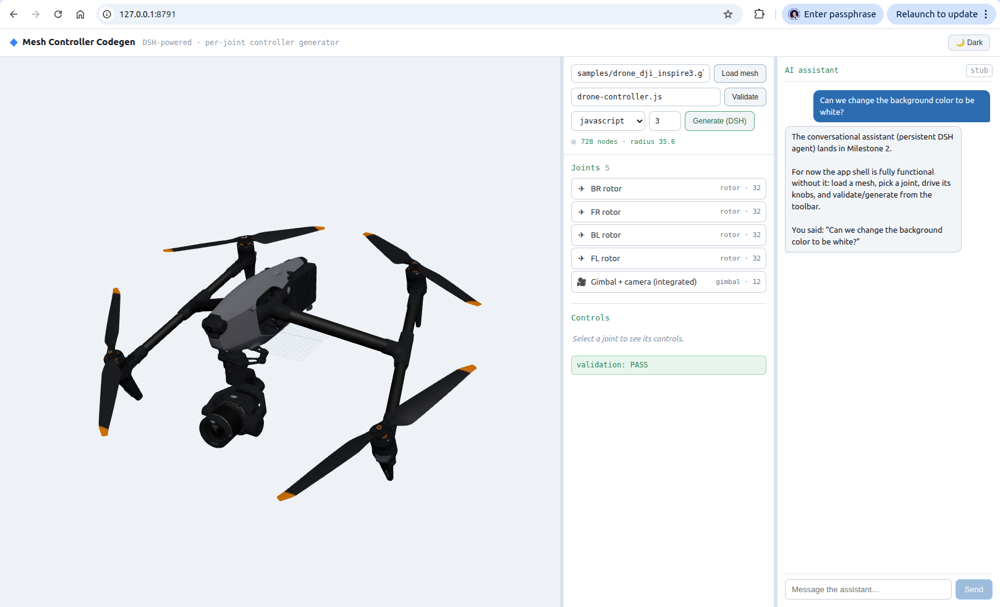
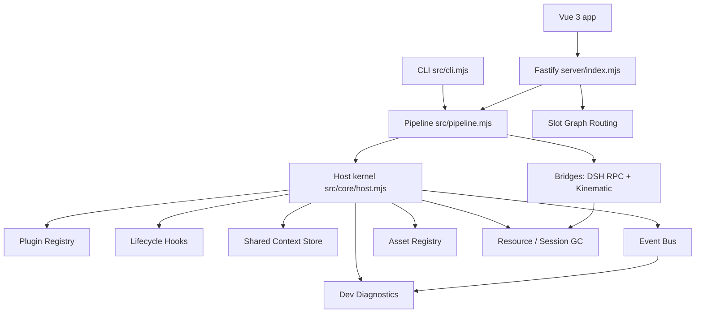

# mesh-controller-codegen

A **DSH-powered code generator** that turns a rigged 3D mesh (`.glb`) into a **per-joint animation controller** you can drop into a `three.js` scene. It discovers the controllable joints (rotors, gimbals, hinges) at *maximal scope*, drafts a language-neutral motion spec, asks an AI agent (via the **DeepSeek Harness, DSH**) to emit controller code, then **deterministically validates** it in a headless `three.js` harness and behind a **live 3D visual gate**.



The tool ships two front-ends over **one shared pipeline**:

- a **CLI** ([`src/cli.mjs`](src/cli.mjs)) for one-shot generation, and
- a **Vue 3 + Fastify web app** ([`app/`](app) + [`server/`](server)) with a 3-pane shell: live mesh viewer · data-driven control knobs · an "AI assistant" chat.

> **DSH is invisible to the user.** In the web app the agent is presented only as a conversational assistant; sessions are **resumable** across restarts.

---

## Table of contents

- [System architecture (the DSH paradigm)](#system-architecture-the-dsh-paradigm)
  - [The 9 kernel primitives](#the-9-kernel-primitives)
  - [How a run flows](#how-a-run-flows)
  - [Plugin set](#plugin-set)
- [Installation](#installation)
- [Usage](#usage)
  - [CLI](#1-cli-one-shot-generation)
  - [Web app](#2-web-app-vue-3--fastify)
  - [The generated controller contract](#the-generated-controller-contract)
  - [Run artifacts](#run-artifacts)
- [Project layout](#project-layout)

---

## System architecture (the DSH paradigm)

The internal design follows the DSH paradigm: **"everything is a plugin"** sitting on a **thin, framework-free kernel** of nine primitives. The kernel is assembled by [`createHost()`](src/core/host.mjs); the domain logic (discovery, joint types, emitters, validators, bridges) is registered as plugins. Adding a new joint type, target language, validator, or discovery strategy means **adding a module — never editing the core**.

Five of the primitives are the kernel *services* ([`src/core/services.mjs`](src/core/services.mjs)); the rest are the registry, the event bus, the slot router, and the bridge/RPC layer.



### The 9 kernel primitives

| # | Primitive | Source | Factory / entry point |
|---|-----------|--------|-----------------------|
| 1 | **Plugin Registry** | [`src/core/registry.mjs`](src/core/registry.mjs) | `createRegistry(bus)` |
| 2 | **Plugin Lifecycle Hooks** | [`src/core/services.mjs`](src/core/services.mjs) | `createLifecycle(bus)` |
| 3 | **Shared Context Store** | [`src/core/services.mjs`](src/core/services.mjs) | `createContext({ projectDir, runDir })` |
| 4 | **Event Bus** | [`src/core/events.mjs`](src/core/events.mjs) | `createEventBus()` |
| 5 | **Asset Registry** | [`src/core/services.mjs`](src/core/services.mjs) | `createAssets(bus, log)` |
| 6 | **Slot Graph Routing** | [`server/slots.mjs`](server/slots.mjs) | `resolveSlotGraph(kernel, joint)` |
| 7 | **Thread Pool / RPC** | [`src/bridges/`](src/bridges) · [`server/dsh-agent.mjs`](server/dsh-agent.mjs) | bridge plugins + `resources.trackChild()` |
| 8 | **Session Garbage Collector** | [`src/core/services.mjs`](src/core/services.mjs) · [`server/session-store.mjs`](server/session-store.mjs) | `createResources(log)` |
| 9 | **Dev Diagnostics** | [`src/core/services.mjs`](src/core/services.mjs) | `createDiagnostics({ bus, runDir, verbose })` |

---

#### 1. Plugin Registry

A catalog of the extension points that genuinely vary. Five categories are frozen in `CATEGORY`:

```
discovery | joint | emitter | validator | bridge
```

A **plugin** is a plain module — no dynamic loading, no sandboxing, deliberately thin. `definePlugin(spec)` normalizes it to `{ category, name, version, contributes, when, activate, deactivate, api }`. The registry stores plugins in a `category → (name → plugin)` map and offers `register / get / has / list / categories / select / summary`. `select(category, ctx)` returns the first plugin whose optional `when(ctx)` predicate passes (default: always), which is how the pipeline picks e.g. the right emitter for a language. `bootPlugin(plugin, host)` registers a plugin, `await`s its `activate(host)`, and wires its `deactivate(host)` into the resource GC.

#### 2. Plugin Lifecycle Hooks

An ordered hook chain over the pipeline stages. `lifecycle.on(hookName, fn)` returns an unsubscribe function; `lifecycle.run(hookName, payload)` runs every hook in order and **threads the payload through** — a hook may return a transformed payload that the next hook receives. Each run emits `lifecycle:<hookName>` on the bus. The hook vocabulary covers the whole pipeline:

```
beforeDiscover / afterDiscover
beforeGenerate / afterGenerate
beforeValidate / afterValidate
beforeVerify   / afterVerify
beforeExport   / afterExport
```

This is distinct from a plugin's own `activate` / `deactivate` lifecycle (handled by `bootPlugin`).

#### 3. Shared Context Store

The **system-of-record for WORK state**. `createContext()` holds `{ mesh, joints, activeJoint, artifacts, motionSpec, conversation, validation, runDir, projectDir }`, where `artifacts` maps `jointName → { spec, code:{js,python,csharp}, validation }` and `motionSpec` is the language-neutral IR for the whole project. It persists to `<runDir>/context.json` via `persist()` and rehydrates via `load()`, so a closed/reopened session restores the joint map and artifacts. `host.shutdown()` always calls `context.persist()` (best-effort) before teardown.

#### 4. Event Bus

The backbone that decouples the async actors (DSH bridge, kinematic bridges, validators, persistence, diagnostics). A thin wrapper over `node:events` with `setMaxListeners(0)`, a **typed name table** (`EVT`), and an `onAny()` tap so diagnostics can trace every event without wildcards. `emit / on / once / off / onAny / listenerCount`; `on`/`once` return unsubscribe functions. Crucially, `dispatch()` sets `type` and `ts` **last**, so a payload field can never clobber the canonical event name (e.g. a joint's `{ type: 'rotor' }` must not become the event type).

Event names: `core:boot`, `core:shutdown`, `asset:registered`, `joint:discovered`, `joint:proposed`, `joint:accepted`, `generate:start`, `generate:done`, `validate:start`, `validate:done`, `bridge:transformFrame`, `ui:knobChanged`, `ui:pickSelected`, `diag`, `error`.

#### 5. Asset Registry

Maps `id → { kind, path, hash, meta, registeredAt }`. Meshes get a **content-addressable** `sha256` hash (first 16 hex chars) for deduplication. `register({ id, kind, path, meta })` throws if the path is missing and emits `asset:registered`; `get / has / list(kind)` round it out. Discovery registers the GLB here before anything else touches it.

#### 6. Slot Graph Routing

The **9th primitive** — deferred from the CLI phase and consumed by the web app to make panel 2 (the control knobs) **fully data-driven**. [`resolveSlotGraph(kernel, joint)`](server/slots.mjs) joins two declarations that already live on each joint-type plugin:

- `contributes.slots` — **which** renderers a joint type wants (render ids → Vue components), and
- `api.knobs(joint)` — the **data** for each command axis (`min / max / step / unit / default`).

It routes each declared slot to its bound command axis, marks derived `*-readout` slots and non-knob `viewer-overlay` slots, and — for completeness — **fills in a default renderer** for any command axis the plugin forgot to declare (`angle → angle-slider`, otherwise `value-slider`). `KNOWN_RENDERS` is the backend↔frontend contract listing every render id a joint type may emit (`speed-slider`, `turn-toggle`, `pitch-slider`, `yaw-slider`, `angle-slider`, `angle-readout`, `value-slider`, `spin-axis`). Served at `GET /api/joints/:id/slots`.

#### 7. Thread Pool / RPC

Work that must run in a **separate execution context** crosses a bridge, and every spawned process is registered with the resource GC so nothing can leak.

- **DSH bridge** ([`src/bridges/dsh-bridge.mjs`](src/bridges/dsh-bridge.mjs)) — the invisible-agent boundary. It `spawn`s `dsh --profile headless --patch bailian.patch.yml [model.patch.yml] <task>` with `cwd = runDir` and `BAILIAN_API_KEY` injected into the child env, streams stdout/stderr to `dsh.log`, and enforces a `dshTimeoutMs` kill timer. The child is tracked via `resources.trackChild(child, 'dsh')`. In the app phase the same plugin slot becomes a **persistent JSON-RPC session**.
- **Kinematic bridges** ([`src/bridges/kinematic/`](src/bridges/kinematic)) — for the JS target, "verifying a controller" *is* the headless `three.js` harness (`tier1`) run in-process; the browser viewer is the live preview. Python/C# targets will stream per-node transforms into the same `tier1` assertions through their own bridges (`bridge:transformFrame`).
- **Persistent agent supervisor** ([`server/dsh-agent.mjs`](server/dsh-agent.mjs)) — the app-phase JSON-RPC host (`dsh --profile web --port 0 --trusted-host …`), driven over `POST /api/<method>` (`session.create`, `session.prompt`, `session.history`, `session.cancel`, `session.selectModel`) with assistant/tool events streamed back over WebSocket/SSE. `session.create` is **idempotent** on a persisted `sessionId` + `cwd` — the resumability primitive. *(M1 ships a stub so the shell is testable without spending model runs; the live supervisor is M2.)*

#### 8. Session Garbage Collector

Two cooperating pieces:

- **Resource GC** ([`createResources`](src/core/services.mjs)) — tracks spawned **child processes**, **temp dirs**, and generic **disposers**; `disposeAll()` SIGTERMs every child, runs disposers LIFO, then `rmSync`s temp dirs. This directly addresses the original *runaway-DSH-process* pain. `host.shutdown()` (wired to `SIGINT`/`SIGTERM`) emits `core:shutdown`, persists context, disposes all resources, and closes diagnostics — idempotently.
- **Session store** ([`server/session-store.mjs`](server/session-store.mjs)) — writes conversation/session state to a **stable path** (`sessions/latest.json`) rather than the per-boot run dir, so reopening the localhost restores the transcript and a pointer to the project. Split of responsibility: **work state** (joints, controllers, validation) lives in the kernel context store; **conversation state** (transcript, DSH `sessionId`) lives here.

#### 9. Dev Diagnostics — event log + trace buffer

Subscribes to **every** bus event via `onAny()` and writes a slim **`trace.jsonl`** into the run dir, plus per-type counters. Writes use a **synchronous fd** (`openSync`/`writeSync`) because the CLI may `process.exit()` immediately after `close()` — an async stream would lose buffered lines. Each traced event is slimmed: long strings are truncated to 200 chars, arrays collapse to `[array:n]`, other objects to `[type]`. `diagnostics.note(msg, data)` emits a `diag` event; `count(type)` returns event counters (folded into `report.json`). This addresses the *opaque-agent-loop* pain by making every step observable.

### How a run flows

[`src/pipeline.mjs`](src/pipeline.mjs) is the shared orchestration used by **both** the CLI and the Fastify backend (same code path, no duplication):

```
discoverJoints      register mesh asset → geometry discovery → motion-spec IR → context.set
validateController  run validator plugins in tier order, short-circuit on first failure
generateController  bounded emit → validate repair loop (onRound streams each round)
repairWithNotes     one human-note-driven repair round (interactive gate)
finalizeRun         persist context + write report.json
```

Validation is tiered: **Tier-0** (static/structural) then **Tier-1** (behavioral — load the controller in headless `three.js`, tick scenarios, assert the contract). Generation is a single emit→validate pass (rounds fixed at 1).

### Plugin set

Registered by [`registerAllPlugins(host)`](src/plugins/index.mjs):

| Category | Plugins |
|----------|---------|
| `discovery` | `geometry` |
| `joint` | `rotor`, `gimbal`, `hinge` |
| `validator` | `tier0`, `tier1` |
| `emitter` | `javascript` (+ python/csharp stubs) |
| `bridge` | `dsh`, `kinematic-node` (+ python/csharp stubs) |

Each joint type declares its `contributes.slots` and single-joint `assertions` (e.g. rotor: `stopAtZero`, `bladesSpinWithHub`, `rpmGrowsWithSpeed`, `diagonalDifferential`).

---

## Installation

### Prerequisites

- **Node.js ≥ 20** (developed on Node 24).
- A **Bailian (Aliyun compatible-mode) API key** for generation, exposed as `config.json → api_key` or the `BAILIAN_API_KEY` env var.

### Steps

```bash
# 1. Clone
git clone https://github.com/kandeng/mesh-controller-codegen.git
cd mesh-controller-codegen

# 2. Root dependencies (Fastify backend + three.js)
npm install

# 3. DSH runtime (the agent harness; provides runtime/node_modules/.bin/dsh)
npm --prefix runtime install

# 4. Web app dependencies (Vue 3 + Vite) — only needed for the web app
npm --prefix app install

# 5. Configure your API key
cp config.example.json config.json
#    then edit config.json and set "api_key"  (or: export BAILIAN_API_KEY=...)
```

`config.json` is **gitignored** — the real key is never committed. All paths in it are resolved relative to the repo root, so nothing is hardcoded to a parent checkout.

### Configuration ([`config.example.json`](config.example.json))

| Key | Default | Meaning |
|-----|---------|---------|
| `api_key` | `""` | Bailian API key (or use `BAILIAN_API_KEY`). |
| `model` | `qwen3.7-max` | Default model id for generation. |
| `bailian_base_url` | token-plan gateway | OpenAI-compatible endpoint. |
| `viewer.port` | `8788` | Default port for the viewer/backend. |
| `dsh_timeout_ms` | `900000` | Kill timer for a DSH child process. |
| `paths.*` | see file | `dsh_bin`, `bailian_patch`, `three`, `samples`, `runs`. |

---

## Usage

### 1. CLI (one-shot generation)

```bash
node src/cli.mjs <glb> [options]
```

| Option | Default | Description |
|--------|---------|-------------|
| `--controller <file>` | — | Skip generation; validate an existing controller module. |
| `--out <file>` | — | Copy the accepted controller here. |
| `--lang <id>` | `javascript` | `javascript` \| `python` \| `csharp` (py/cs are stubs). |
| `--model <id>` | from config | Bailian model id. |
| `--rounds <n>` | `1` | Max repair rounds (single pass by default). |
| `--gate <mode>` | `interactive` | `interactive` (opens the live 3D viewer + prompts) \| `auto`. |
| `--port <n>` | from config | Viewer HTTP port. |
| `--config <file>` | `<repo>/config.json` | Config path. |
| `--verbose` | off | Trace every event to stderr. |

**Generate a controller** (interactive visual gate):

```bash
node src/cli.mjs samples/drone_dji_inspire3.glb --lang javascript
```

**Validate-only + auto gate** (the bundled smoke test):

```bash
npm run prove
# = node src/cli.mjs samples/drone_dji_inspire3.glb --controller drone-controller.js --gate auto
```

When the interactive gate passes, the CLI prints a **human visual-verification checklist** and serves the live viewer at `http://127.0.0.1:<port>/viewer/viewer.html?glb=…&ctl=…`. Type `pass` to accept, or describe what's wrong to trigger a note-driven repair round.

### 2. Web app (Vue 3 + Fastify)

```bash
# Build the SPA (outputs to app/dist, served by the backend at '/')
npm run app:build

# Start the backend (boots ONE long-lived kernel host)
npm run server                 # or: node server/index.mjs --port 8791
```

Open the printed address (e.g. `http://127.0.0.1:8788`). For front-end development with hot reload:

```bash
npm run server        # terminal A — backend + API
npm run app:dev       # terminal B — Vite dev server (proxies /api to the backend)
```

The shell has three draggable panes — **3D mesh viewer · control knobs · AI assistant** — with a dark/light theme toggle (persisted in browser `localStorage`). The knob panel is rendered entirely from the **Slot Graph** for the active joint.

**Backend integration test** (health, SPA serving, discovery, slot graphs, validation, resume, WebSocket events):

```bash
npm run prove:shell -- http://127.0.0.1:8788
```

#### REST / WS surface

| Method & path | Purpose |
|---------------|---------|
| `GET /api/health` | Plugins, run dir, agent status. |
| `GET /api/state` | Current server-side project state (for load/resume). |
| `POST /api/project` `{ glb }` | Register asset + discover joints. |
| `POST /api/validate` `{ file }` | Validate a controller against the loaded mesh. |
| `POST /api/generate` `{ lang, model }` | Single emit→validate generate pass (rounds fixed at 1). |
| `GET /api/joints/:id/slots` | Slot Routing Graph for a joint. |
| `GET /api/session/resume` | Persisted session (transcript + project pointer). |
| `WS /api/events` | Live kernel bus events (hello + stream). |

### The generated controller contract

Emitted controllers are **ES modules** exporting a single factory. The test harness and viewer import exactly this shape:

```js
import { createDroneController } from './drone-controller.js';

const ctl = createDroneController(gltfSceneRoot, THREE);

ctl.update(dtSeconds);          // call once per animation frame
ctl.setSpeed(metersPerSecond);  // 0 = hover; speed eases toward target
ctl.turnLeft(); ctl.turnRight(); ctl.goStraight();
ctl.setGimbal(pitchDeg, yawDeg);// pitch clamped to [-90, 30], yaw to [-120, 120]
ctl.getState();                 // { speed, headingDeg, props:[{name, rpm}], gimbal:{pitch, yaw} }
```

Controllers use **only** the `THREE` namespace passed as the second argument — no imports, DOM, network, timers, or globals — and must guard every node lookup (warn once and skip; never throw).

### Run artifacts

Each run writes to `runs/<timestamp>/`:

| File | Contents |
|------|----------|
| `context.json` | Shared Context Store snapshot (work state). |
| `trace.jsonl` | Dev Diagnostics event trace (one slim JSON object per event). |
| `report.json` | Final result: accepted, rounds, failures, warnings, metrics, joints, diagnostic counts. |
| `dsh.log` | The DSH child process output. |
| `controller.mjs` / `controller.view.js` | Generated controller (and the copy the viewer imports). |
| `task.md` | The generation task handed to DSH. |

---

## Project layout

```
src/
  core/         host.mjs · registry.mjs · events.mjs · services.mjs   (the 9 primitives)
  plugins/      discovery/ · joints/ · emitters/ · validators/ · index.mjs
  bridges/      dsh-bridge.mjs · kinematic/                            (Thread Pool / RPC)
  ir/           motion-spec.mjs                                        (language-neutral IR)
  lib/          gltf.mjs · prompt.mjs · tier0.mjs · tier1.mjs
  pipeline.mjs  shared orchestration (CLI + backend)
  cli.mjs       CLI entry point
  config.mjs    config loader (repo-relative path resolution)
server/         Fastify backend: index · kernel-host · slots · session-store · routes/ · dsh-agent
app/            Vue 3 + Vite shell (src/components, src/composables, style.css)
viewer/         standalone viewer.html (live 3D gate)
tool/           legacy gen-controller + libs
samples/        drone_dji_inspire3.glb (demo mesh)
runtime/        DSH runtime (its own package.json; node_modules gitignored)
test/           verify-shell.mjs backend integration harness
```

## License

MIT
